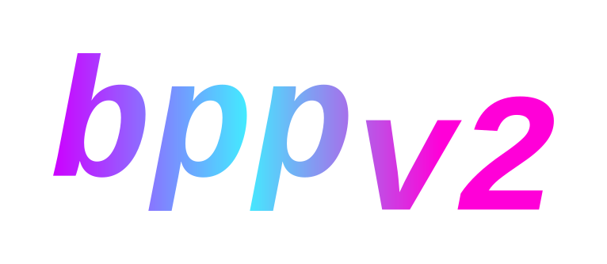

# BPP
- ***is** a Blacket modification providing in-browser and userscript support. It uses modern standards, provides innovative features, and provides features for easy development of official and user-made plugins.*
- ***is** easy-to-use and customizable in an accessible and simple manner.*
- *is **NOT** a hack or cheat violating EULA, but rather a safe and acceptable utility providing support for many modifications following the EULA.*

   

&nbsp;&nbsp;&nbsp;&nbsp;&nbsp;&nbsp;&nbsp;&nbsp;&nbsp;&nbsp;   
&nbsp;&nbsp;&nbsp;&nbsp;&nbsp;&nbsp;&nbsp;&nbsp;&nbsp;&nbsp;   
&nbsp;&nbsp;&nbsp;&nbsp;&nbsp;&nbsp;&nbsp;&nbsp;&nbsp;&nbsp;

# Planning and Feature Status

&nbsp;&nbsp;&nbsp;&nbsp;&nbsp;&nbsp;&nbsp;&nbsp;&nbsp;&nbsp;

## REQUIRED *(DO THIS NOW)*
- **[IN PROGRESS]** Actually finish the registrar/initializer
- **[PLANNING/BRAINSTORMING]** Collect and apply patches via PatchManager.
- **[INCOMPLETE]** Finish built-in plugins.
    - *Optionally* - Provide an external repository for optional, official plugins to reduce script size.
- **[PLANNING/BRAINSTORMING]** Start API wrapper
    - **MAKE SURE THIS IS SIMPLE** - Developing plugins should be motivating and encouraging rather than worrying and confusing.
- **[IN PROGRESS]** Start theming support
    - Start reverse-engineering class names for BPP UI and Blacket UI.
         - So users have an easier time theming Blacket through explanative variable names rather than confusing classes.
    - **[DONE]** ~~Start CSS parser - **OR**: @zastlx is looking into the cost of bundling a SASS compiler.~~

&nbsp;&nbsp;&nbsp;&nbsp;&nbsp;&nbsp;&nbsp;&nbsp;&nbsp;&nbsp;

## Planned
**Customizations**
- **[APPROVED BY XOTIC, PLANNING]** User-defined (third-party) plugins

---
**API**
- **[PLANNING/BRAINSTORMING]** API wrapper exposed internally and to user-defined plugins
    - ***Caveats*** - Cannot make APIs to write to chat or purchase from bazaar.

---
**Plugins**
- **[PLANNING/BRAINSTORMING]** Staff
- **[PLANNING/BRAINSTORMING]** Pack opener
- **[PLANNING/BRAINSTORMING]** Mini chat

&nbsp;&nbsp;&nbsp;&nbsp;&nbsp;&nbsp;&nbsp;&nbsp;&nbsp;&nbsp;
## Doing
- **[IN PROGRESS]** User themes with extreme support for easy, extensible UI customization through defined variables and presets for BPP and Blacket's UI classes.

&nbsp;&nbsp;&nbsp;&nbsp;&nbsp;&nbsp;&nbsp;&nbsp;&nbsp;&nbsp;
## Implemented
**Build script**
- **[GOOD]** Plugins - *GetAllPlugins - Dynamically obtain, load and expose a list of all internal plugins via an ESBuild plugin.*
- **[GOOD]** ESBuild script - *Written in TypeScript, executed by Bun - To build BPP in a type-safe manner*

---
**Base(d)**
- **[LOGGABLE - NEEDS FULL REVIEW]** Base classes - *Plugins and Loggables*
- **[GOOD]** Base types - *Phaser types, patch types/interfaces, plugin types/interface, consts*

---
**Managers**
- **[GOOD]** Managers - *PluginManager, PatchManager*

---
**Patcher**
- **[NEEDS FULL REVIEW]** Hard-patching support - *Similar to Vencord*
    - The initial hard patcher was rewritten to operate better and to be more faithful to Vencord's.
- **[NEEDS FULL IMPLEMENTATION]** Soft-patching support - *Via Spitroast*

---
**Patching**
- **[EXPERIMENTAL]** Soft refresh and patch - *This way, we can apply patches to Blacket even after Blacket has fully loaded*
- **[REMOVED]** ~~The option to hard refresh, intercept and patch for Tampermonkey users.~~

&nbsp;&nbsp;&nbsp;&nbsp;&nbsp;&nbsp;&nbsp;&nbsp;&nbsp;&nbsp;   
&nbsp;&nbsp;&nbsp;&nbsp;&nbsp;&nbsp;&nbsp;&nbsp;&nbsp;&nbsp;   

# Built-in or Official Plugins
- *InternalsPlugin* - Does not provide special features, but handles BPP's internal functions.
- **Brainstorming/Under Review**
    - **[BRAINSTORMING]** *SafePlugin* - Provides functionality to make Blacket completely safe for children, preventing curse words from being sent and censoring curse words in received messages and automatically identifying and deleting messages with adult content via NSFWJS.
    - **[BRAINSTORMING]** *StaffPlugin* - Allows staff to blacklist and automatically delete messages with certain blacklisted words or phrases and have an easy GUI to monitor and moderate chat from anywhere and ban and mute members from any page.
    - **[BRAINSTORMING]** *PackSpammerPlugin* - *Follows EULA, pack spammers were allowed by Syfe.* Allows users to spam-open packs at an acceptable rate-limit.
    - **[BRAINSTORMING]** *BazaarNotifierPlugin* - *Follows EULA, does not automate buying.* Notifies users about new deals on the bazaar/auction house instead of automatically buying them at an acceptable ratelimit.

&nbsp;&nbsp;&nbsp;&nbsp;&nbsp;&nbsp;&nbsp;&nbsp;&nbsp;&nbsp;   
&nbsp;&nbsp;&nbsp;&nbsp;&nbsp;&nbsp;&nbsp;&nbsp;&nbsp;&nbsp;   
&nbsp;&nbsp;&nbsp;&nbsp;&nbsp;&nbsp;&nbsp;&nbsp;&nbsp;&nbsp; 

# Supporting
**The developers would like to acknowledge and publicly support the following groups/movements**:   
 The developers support, acknowledge, and care about those who are transgender or questioning.   
 The developers support, acknowledge, and care about those who are non-binary or questioning.   
 The developers support, acknowledge, and care about the rest of the LGBTQ+ community or those who are questioning.
&nbsp;&nbsp;&nbsp;&nbsp;&nbsp;&nbsp;&nbsp;&nbsp;&nbsp;&nbsp;   
&nbsp;&nbsp;&nbsp;&nbsp;&nbsp;&nbsp;&nbsp;&nbsp;&nbsp;&nbsp;   
&nbsp;&nbsp;&nbsp;&nbsp;&nbsp;&nbsp;&nbsp;&nbsp;&nbsp;&nbsp;   
